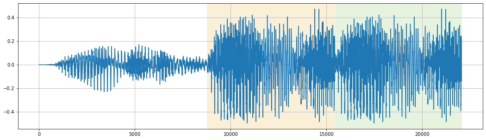

Работа с папками
++++++++++++++++

Изображения
=============

Ширина
------
В поле ``Ширина`` следует ввести целочисленное значение ширины картинки при создании массивов.

Высота
------
В поле ``Высота`` следует ввести целочисленное значение высоты картинки при создании массивов.

Сеть
----
.. На выбор доступно два режима - ``Сверточный`` и ``Линейный``.

Режим ``Сверточный`` не предполагает никаких операций с полученным после чтения изображения массивом.

Режим ``Линейный`` предполагает перевод массива изображения в векторное представление.
Например, трёхканальное изображение 100х100 из массива с размерностью (100, 100, 3) превратится в (30000,).

.. image:: images/изображения_сеть.png
    :alt: изображения_сеть.png

.. note::
    После перевода массивов изображения в векторное представление нельзя будет использовать сверточный слой в качестве первого слоя в нейронной сети.

.. _imageMode:

Режим изображения
-----------------
Режим ``Растянуть`` подгоняет исходное изображение под заданную высоту и ширину, не сохраняя её пропорции.

Режим ``Вписать`` подгоняет исходное изображение под заданную высоту и ширину с сохранением пропорций исходного изображения.
Если заданные параметры высоты или ширины оказались больше исходного изображения, лишнее пространство изображения заполняется чёрным цветом.

Режим ``Обрезать`` подгоняет исходное изображение под заданную высоту и ширину, обрезая невошедшее в рамки заданной ширины и высоты исходя из центра изображения.
Если исходное изображение оказалось меньше заданной высоты и ширины, или одна из её сторон оказалась меньше, лишнее пространство изображения заполняется чёрным цветом.

.. list-table:: Режимы изображения. Размер обработанных картинок - 500х500px
    :widths: 300, 300, 300
    :header-rows: 1

    * - Растянуть
      - Вписать
      - Обрезать

    * - .. figure:: images/изображения_цветок_растянуть.png
          :alt: изображения_цветок_растянуть.png
          :align: center

          Оригинал - 300х200px

      - .. figure:: images/изображения_цветок_вписать.png
          :alt: изображения_цветок_растянуть.png
          :align: center

          Оригинал - 300х200px

      - .. figure:: images/изображения_цветок_обрезать.png
          :alt: изображения_цветок_растянуть.png
          :align: center

          Оригинал - 300х200px

    * - .. figure:: images/изображения_жираф_растянуть.png
          :alt: изображения_цветок_растянуть.png
          :align: center

          Оригинал - 600х950px

      - .. figure:: images/изображения_жираф_вписать.png
          :alt: изображения_цветок_растянуть.png
          :align: center

          Оригинал - 600х950px

      - .. figure:: images/изображения_жираф_обрезать.png
          :alt: изображения_цветок_растянуть.png
          :align: center

          Оригинал - 600х950px

Скейлер
-------
**MinMaxScaler**

В процессе обучения данный объект проводит поиск среди всех значений массивов с целью нахождения минимального и максимального значения.
В дальнейшем, при использовании скейлера для трансформирования массива, все элементы интерполируются в диапазоне между минимальным и максимальным значением и значениями, указанными в полях ``Минимальный скейлер`` и ``Максимальный скейлер``.

.. list-table:: Пример трансформации вектора с использованием MinMaxScaler.
    :widths: 30, 30, 30, 30, 30, 30, 30, 30, 30, 30
    :header-rows: 1

    * - -3.96
      - -3.12
      - -2.44
      - -1.23
      - 0.33
      - 1.74
      - 3.54
      - 4.23
      - 5.12
      - 6.32

    * - 0.0
      - 0.08
      - 0.15
      - 0.27
      - 0.42
      - 0.55
      - 0.73
      - 0.80
      - 0.88
      - 1.0

**TerraImageScaler**

В процессе обучения данный объект проводит поиск среди всех значений массивов изображений с целью нахождения минимального и максимального значений *индивидуально для каждого пикселя и каждого из трёх RGB каналов*.
В дальнейшем, при использовании скейлера для трансформирования массивов изображений, все значения каждого пикселя по трём RGB каналам интерполируются в собственном диапазоне минимального и максимального значений между 0 и 1.

.. note::
    Использование данного скейлера с режимом сети ``Линейный`` невозможно.

**Не применять**

При выборе данного режима никаких трансформаций массивов происходить не будет.

.................................................................

Видео
========================

Ширина кадра
------------
В поле ``Ширина кадра`` следует ввести целочисленное значение ширины видеокадра при создании массивов.

Высота кадра
------------
В поле ``Высота кадра`` следует ввести целочисленное значение высоты видеокадра при создании массивов.

Заполнение недостающих кадров
-----------------------------
Режим ``Последним кадром`` копирует последний кадр видео.

Режим ``Средним значением`` формирует последний кадр исходя из среднего значения каждого пикселя на протяжении всего видео.
На таком кадре все движущиеся объекты будут размыты.

Режим ``Зациклить`` добавляет новый видеоряд путём перемотки видео до тех пор, пока количество кадров не достигнет требуемого.

.. list-table:: Заполнение недостающих кадров.
    :widths: 300, 300, 300
    :header-rows: 1

    * - Последним кадром
      - Средним значением
      - Зациклить

    * - .. figure:: images/видео_последним_кадром.gif
          :alt: видео_черными кадрами.gif
          :align: center

      - .. figure:: images/видео_средними_значениями.gif
          :alt: видео_последним кадром.gif
          :align: center

      - .. figure:: images/видео_зациклить.gif
          :alt: видео_зациклить.gif
          :align: center

Обработка кадров
----------------
Режим ``Растянуть`` подгоняет каждый кадр под заданную высоту и ширину, не сохраняя её пропорции.

Режим ``Вписать`` подгоняет каждый кадр под заданную высоту и ширину с сохранением пропорций исходного кадра.
Если заданные параметры высоты или ширины оказались больше исходного кадра, лишнее пространство заполняется чёрным цветом.

Режим ``Обрезать`` подгоняет каждый кадр под заданную высоту и ширину, обрезая невошедшее в рамки заданной ширины и высоты исходя из центра кадра.
Если исходный кадр оказалось меньше заданной высоты и ширины, или одна из её сторон оказалась меньше, лишнее пространство заполняется чёрным цветом.

.. list-table:: Режимы видео. Размер оригинального кадра - 240х320px
    :widths: 300, 300, 300
    :header-rows: 1

    * - Растянуть
      - Вписать
      - Обрезать

    * - .. figure:: images/видео_растянуть.png
          :alt: видео_растянуть.png
          :align: center

          100х150px

      - .. figure:: images/видео_вписать.png
          :alt: видео_вписать.png
          :align: center

          100х150px

      - .. figure:: images/видео_обрезать.png
          :alt: видео_обрезать.png
          :align: center

          100х150px
    

    * - .. figure:: images/видео_растянуть_2.png
          :alt: видео_растянуть_2.png
          :align: center

          300х350px

      - .. figure:: images/видео_вписать_2.png
          :alt: видео_вписать_2.png
          :align: center

          300х350px

      - .. figure:: images/видео_обрезать_2.png
          :alt: видео_обрезать_2.png
          :align: center

          300х350px

Формат видео
------------
Режим ``Целиком`` предполагает обрезку каждого видеофайла по количеству кадров, указанным в поле ``Количество кадров``.

Режим ``По длине и шагу`` предполагает сохранение фрагментов видеофайлов по определённой длине и сдвигу на определённый шаг по каждому видеофайлу до тех пор, пока шаг не станет меньше оставшейся длины видео. 
Если шаг стал меньше оставшейся длины видео, сдвиг происходит на расстояние оставшейся длины видео. 
Таким образом, последние кадры видео будут включены в выборки в любом случае. При выборе данного режима открываются поля ``Длина`` и ``Шаг``.

Скейлер
-------

**MinMaxScaler**

В процессе обучения данный объект проводит поиск среди всех значений массивов с целью нахождения минимального и максимального значения.
В дальнейшем, при использовании скейлера для трансформирования массива, все элементы интерполируются в диапазоне между минимальным и максимальным значением и значениями, указанными в полях ``Минимальный скейлер`` и ``Максимальный скейлер``.

.. list-table:: Пример трансформации вектора с использованием MinMaxScaler.
    :widths: 30, 30, 30, 30, 30, 30, 30, 30, 30, 30
    :header-rows: 1

    * - -3.96
      - -3.12
      - -2.44
      - -1.23
      - 0.33
      - 1.74
      - 3.54
      - 4.23
      - 5.12
      - 6.32

    * - 0.0
      - 0.08
      - 0.15
      - 0.27
      - 0.42
      - 0.55
      - 0.73
      - 0.80
      - 0.88
      - 1.0

**Не применять**

При выборе данного режима никаких трансформаций массивов происходить не будет.

.................................................................

Аудио
============

Частота дискретизации
---------------------
Параметр ``Частота дискретизации`` указывает на количество измерений аудиосигнала в секунду. 

Формат аудио
------------
Режим ``Целиком`` предполагает обрезку каждого аудиофайла по количеству секунд, указанным в поле ``Длина аудио``.

Режим ``По длине и шагу`` предполагает сохранение фрагментов аудиофайлов по определённой длине и сдвигу на определённый шаг по каждому аудиофайлу до тех пор, пока шаг не станет меньше оставшейся длины аудио.
При выборе данного режима открываются поля ``Длина`` и ``Шаг``.

Заполнение недостающих аудио-дорожек
------------------------------------
Режим ``Последней миллисекундой`` копирует последнюю миллисекунду аудиофайла на протяжении всего недостающего отрезка.

Режим ``Зациклить`` заполняет недостающий отрезок аудиофайла путём копирования фрагмента обрабатываемого аудиофайла и добавление в него до тех пор, пока не будет заполнен недостающий отрезок.

    Пример обработки аудиофайла длиной 0.7сек. и частотой дискретизации 22050 режимом ``Зациклить`` до 1сек. Желтым обозначен копируемый фрагмент, зеленым - заполненный.

Параметр
--------
**Audio signal**

Чистый аудиосигнал без обработки. Длина аудиосигнала равна частоте дискретизации умноженной на длину аудиофайла в секундах.

Чистый аудиосигнал в дальнейшем используется для расчета следующих параметров аудио (при их выборе):

`Chroma STFT <https://librosa.org/doc/main/generated/librosa.feature.chroma_stft.html>`_

Хромаграмма или хроматический вектор обычно представлен набором признаков из 12 элементов, характеризующих интенсивность полутонов музыкальной гаммы (C = до, C# = до диез, D = ре, D# = ре диез и так далее) в исследуемом звуке. 
Используется для выделения и анализа мелодических признаков в музыкальном аудиосигнале.

`MFCC <https://librosa.org/doc/main/generated/librosa.feature.mfcc.html>`_

Представляют собой небольшой набор признаков (обычно 10–20), которые кратко описывают структуру спектра звука. 
Фильтры, которыми выделяются коэффициенты, основаны на особенностях человеческого восприятия звука: древним людям важнее было распознавать низкочастотные звуки, что отразилось в эволюции органов слуха.

`RMS <https://librosa.org/doc/main/generated/librosa.feature.rms.html>`_

`Spectral centroid <https://librosa.org/doc/main/generated/librosa.feature.spectral_centroid.html>`_

Спектральный центроид указывает вблизи какой частоты сосредоточена большая часть энергии спектра.
Другими словами, указывает, где расположен «центр масс» звука.

`Spectral bandwidth <https://librosa.org/doc/main/generated/librosa.feature.spectral_bandwidth.html>`_

`Spectral roll-off <https://librosa.org/doc/main/generated/librosa.feature.spectral_rolloff.html>`_

Мера формы сигнала, представляющая собой частоту, выше которой энергия звука практически отсутствует. 
Для ее получения определяют частотную границу, ниже которой лежит 85% всей мощности аудиосигнала.

`Zero-crossing rate <https://librosa.org/doc/main/generated/librosa.feature.zero_crossing_rate.html>`_

Частота (или скорость) пересечения нуля соответствует общей оценке тембра звучания по шкале высокий/низкий, глухой/звонкий, шипящий/свистящий. 

Ресемпл
-------
Тип ресемпла, используемый во время открытия аудиофайлов. Сильно влияет на скорость формирования датасета. Список доступных типов (в порядке возрастания скорости): ``Kaiser best``, ``Kaiser fast``, ``Scipy``.
Более подробно можно прочитать `здесь <https://librosa.org/doc/main/generated/librosa.resample.html#librosa.resample>`_.

Скейлер
-------

**MinMaxScaler**

В процессе обучения данный объект проводит поиск среди всех значений массивов с целью нахождения минимального и максимального значения.
В дальнейшем, при использовании скейлера для трансформирования массива, все элементы интерполируются в диапазоне между минимальным и максимальным значением и значениями, указанными в полях ``Минимальный скейлер`` и ``Максимальный скейлер``.

.. list-table:: Пример трансформации вектора с использованием MinMaxScaler.
    :widths: 30, 30, 30, 30, 30, 30, 30, 30, 30, 30
    :header-rows: 1

    * - -3.96
      - -3.12
      - -2.44
      - -1.23
      - 0.33
      - 1.74
      - 3.54
      - 4.23
      - 5.12
      - 6.32

    * - 0.0
      - 0.08
      - 0.15
      - 0.27
      - 0.42
      - 0.55
      - 0.73
      - 0.80
      - 0.88
      - 1.0

**StandardScaler**

При обучении скейлер проводит поиск среди всех значений массивов с целью находждения дисперсии, среднего значения.
При использовании скейлера трансформация массивов происходит по формуле **(x - среднее значение) / дисперсия**.

.. list-table:: Пример трансформации вектора с использованием StandardScaler.
    :widths: 30, 30, 30, 30, 30, 30, 30, 30, 30, 30
    :header-rows: 1

    * - -3.96
      - -3.12
      - -2.44
      - -1.23
      - 0.33
      - 1.74
      - 3.54
      - 4.23
      - 5.12
      - 6.32

    * - -1.44
      - -1.20
      - -1.00
      - -0.65
      - -0.21
      - 0.20
      - 0.71
      - 0.91
      - 1.17
      - 1.51

**Не применять**

При выборе данного режима никаких трансформаций массивов происходить не будет.

.................................................................

Текст
===============

Фильтры
-------
Поле ``Фильтры`` содержит в себе набор символов, которые будут удалены в процессе обработки текстовых файлов.

.. note::
    При выборе задачи сегментации текстов из списка фильтров автоматически убираются символы, используемые в составе тегов.

Формат текстов
--------------
Режим ``Целиком`` предполагает обрезку каждого текстового файла по количеству слов, которое указывается в поле ``Количество слов``.

Режим ``По длине и шагу`` предполагает сохранение фрагментов текстов по определённой длине и сдвигу на определённый шаг из каждого текстового файла до тех пор, пока шаг не станет меньше оставшегося количества слов.
При выборе данного режима открываются поля ``Длина`` и ``Шаг``.

Пример работы режима ``По длине и шагу`` 4 и 2 соответственно:

* **Съешь еще этих мягких** французских булочек да выпей чаю.
* Съешь еще **этих мягких французских булочек** да выпей чаю.
* Съешь еще этих мягких **французских булочек да выпей** чаю.

.. note::
    Режим ``Целиком`` рекомендуется выбирать только в случае большого количества файлов в выбранной папке, так как один файл превращается в одну выборку.

    Режим ``По длине и шагу`` способен создать из одного текстового файла несколько выборок.

Pymorphy
--------
При использовании ``Pymorphy`` слова будут переведены в инфинитив. Подробнее на странице документации `Pymorphy2 <https://pymorphy2.readthedocs.io/en/stable/user/>`_.

Метод подготовки
----------------
Режимы ``Embedding`` и ``Bag of words`` во время обработки текстов используют объект `Tokenizer <https://ru-keras.com/text-preprocessing/>`_.
При выборе данных режимов в поле ``Максимальное количество слов`` необходимо ввести длину словаря частотности слов, который образуется в процессе обучения данного объекта. 
При формировании словаря каждому уникальному слову присваивается индекс. Чем чаще встречается слово в тексте, тем меньше будет значение присвоенного индекса (самому популярному слову присваивается индекс 2). Если слово вышло за рамки словаря частотности слов, ему присваивается индекс 1.
Словарь используется в процессе перевода текстовых данных в числовые.

Режим ``Word2Vec`` во время обработки текстов использует объект `Word2Vec <https://radimrehurek.com/gensim/models/word2vec.html>`_. 
После выбора данного режима открывается поле ``Размер Word2Vec пространства``, в котором обозначается размер n-мерного пространство для слов.

**Embedding**

При выборе режима ``Embedding`` содается вектор длиной равным значению в поле ``Длина`` и с индексами слов, исходя из словаря частотности.
В случае, если в текстовом файле количество слов меньше введённого пользователем числа, при формировании массивов они будут дописаны нулями.

.. list-table:: Режим Embedding.
    :widths: 15, 15, 15, 15, 15, 15, 15, 15
    :header-rows: 1

    * - Съешь
      - ещё
      - этих
      - мягких
      - булочек
      - да
      - выпей
      - чаю.

    * - 438
      - 132
      - 33
      - 301
      - 182
      - 19
      - 387
      - 101

Полученный вектор (при условии параметра ``Длина`` равным 10): [438, 132, 33, 301, 182, 19, 387, 101, 0, 0]

**Bag of words**

При выборе режима ``Bag of words`` содается вектор из нулей длиной в ``Максимальное количество слов``, и заполняется единицами исходя из индексов слов в словаре частотности. При этом порядок слов утрачивается.
Рассмотрим пример одного предложения с ``Максимальное количество слов`` равным 15 (условимся, что все слова из предложения попали в 15 самых наиболее встречающихся слов).

.. list-table:: Режим Bag of words.
    :widths: 15, 15, 15, 15, 15, 15, 15, 15
    :header-rows: 1

    * - Миша
      - любит
      - кататься
      - на
      - горках
      - и
      - на
      - санках.

    * - 3
      - 6
      - 14
      - 2
      - 12
      - 5
      - 2
      - 13

Полученный вектор: [0, 0, 1, 1, 0, 1, 1, 0, 0, 0, 0, 0, 1, 1, 1]

**Word2Vec**

При выборе режима ``Word2Vec`` массивы формируются исходя из обученного векторного пространства слов объекта Word2Vec.
Длина вектора каждого слова имеет длину равной длине векторного пространства, установленной в параметре ``Размер Word2Vec пространства``.
Рассмотрим пример предложения с ``Размер Word2Vec пространства`` равным 2 (стандартным является значение 200, однако для демонстрационных целей в данной документации применим значение 2).

.. list-table:: Режим Word2Vec.
    :widths: 15, 15, 15, 15, 15, 15, 15, 15
    :header-rows: 1

    * - Съешь
      - ещё
      - этих
      - мягких
      - булочек
      - да
      - выпей
      - чаю.

    * - [0.1971.. 0.1885..]
      - [0.1132.. 0.1560..]
      - [0.2349.. 0.0148..]
      - [0.1552.. -0.1250..]
      - [0.1177.. -0.1929..]
      - [-0.2087.. 0.0028..]
      - [0.2432.. 0.0589..]
      - [0.1813.. -0.0266..]

Полученный вектор (при условии параметра ``Длина`` равным 10): [[0.1971.. 0.1885..], [0.1132.. 0.1560..], [0.2349.. 0.0148..], [0.1552.. -0.1250..], [0.1177.. -0.1929..], [-0.2087.. 0.0028..], [0.2432.. 0.0589..], [0.1813.. -0.0266..], [0 0], [0 0]]

.................................................................

Классификация
=============
Слой классификации не предполагает ввода дополнительных параметров в интерфейсе Terra AI.

.. note::
    Названия классов формируются исходя из названий папок, выбранных в качестве входных данных.
    Если названия папок подверглись изменениям из-за несоответствия кодировок в среде создания архива и среде запуска Terra AI, названия классов тоже будут подвержены изменениям.

.................................................................

Сегментация изображений
=======================

Диапазон каналов
----------------
В поле ``Диапазон каналов`` следует ввести целочисленное значение диапазона для каждого из RGB каналов. 
Например, при цвете класса [201, 157, 21] и диапазоне 20 к данному классу будут отнесены все пиксели со значением в диапазонах [181-221, 137-177, 1-41].

.. note::
    Значение диапазона индивидуально для каждой базы и зависит от степени потери качества изображений масок сегментации - чем больше потери в качестве, тем большее число рекомендуется к установке.
    Однако следует учесть, что при близком расположении цветов по RGB каналам, и значением ``Диапазон каналов`` бо́льшим этого расположения, классы могут пересечься.
    При отсутствии потери качества изображений масок сегментации, диапазон следует установить равным 0.

Ввод данных
-----------
Режим ``Ручной ввод`` предполагает ручное заполнение полей ``Название класса`` и ``Цвет``. Количество блоков с полями к заполнению соответствует количеству классов, указанному в поле ``Количество классов``.

Режим ``Автоматический поиск`` проводит поиск цветов классов в изображениях масок сегментации и выводит список найденных цветов пользователю для дальнейшего заполнения названий найденных классов.
Для запуска поиска требуется заполнить поля ``Диапазон каналов`` и ``Количество классов``.

.. note::
    Поиск цветов классов осуществляется начиная с первой картинки в выбранной папке пока не будет найдено то количество цветов, которое было указано в поле ``Количество классов``.

Режим ``Файл аннотации`` предполагает заполнение блоков с названиями и цветами классов из данных, полученных из файла аннотации.
Для работы этого режима архив с датасетом должен содержать файл аннотации в корректном исполнении.
Пример корректного файла аннотации можно найти :ref:`здесь <annotationFile>`.

.................................................................

Сегментация текстов
===================

Открывающие теги (через пробел)
-------------------------------
В поле ``Открывающие теги (через пробел)`` следует ввести открывающие теги, которые были использованы в процессе разметки текстов.

Закрывающие теги (через пробел)
-------------------------------
В поле ``Закрывающие теги (через пробел)`` следует ввести закрывающие теги, которые были использованы в процессе разметки текстов.

.................................................................

Обнаружение объектов
====================
Координаты баундин боксов масштабируются и приводятся к необходимому для обучения размеру 416х416.
Также на способ масштабирования координатов может повлиять :ref:`Режим изображения <imageMode>`, выбранный во входном слое изображений.

.. list-table:: Режимы изображения. Размер обработанных картинок - 416х416px
    :widths: 300, 300, 300
    :header-rows: 1

    * - Растянуть
      - Вписать
      - Обрезать

    * - .. figure:: images/обджект_цветок_растянуть.png
          :alt: обджект_цветок_растянуть.png
          :align: center

          Оригинал - 300х200px

      - .. figure:: images/обджект_цветок_вписать.png
          :alt: обдждект_цветок_растянуть.png
          :align: center

          Оригинал - 300х200px

      - .. figure:: images/обджект_цветок_обрезать.png
          :alt: обджект_цветок_растянуть.png
          :align: center

          Оригинал - 300х200px

    * - .. figure:: images/обджект_жираф_растянуть.png
          :alt: обджект_цветок_растянуть.png
          :align: center

          Оригинал - 600х950px

      - .. figure:: images/обджект_жираф_вписать.png
          :alt: обджект_цветок_растянуть.png
          :align: center

          Оригинал - 600х950px

      - .. figure:: images/обджект_жираф_обрезать.png
          :alt: обджект_цветок_растянуть.png
          :align: center

          Оригинал - 600х950px

Версия Yolo
-----------
Следует выбрать одну из доступных версий Yolo для создания датасета и его обучения.

Доступные версии Yolo: ``v3``, ``v4``.

Тип аннотации
-------------
Тип аннотации определяется при выгрузке архива из сервисов аннотации изображений.
В зависимости от выбора типа при выгрузке необходимо выбрать соответствующий тип при формировании датасета в Терре.

Список доступных типов аннотаций: ``Yolo``, ``Yolov1.1``, ``Kitti``, ``Voc``, ``Coco``, ``Udacity``.
